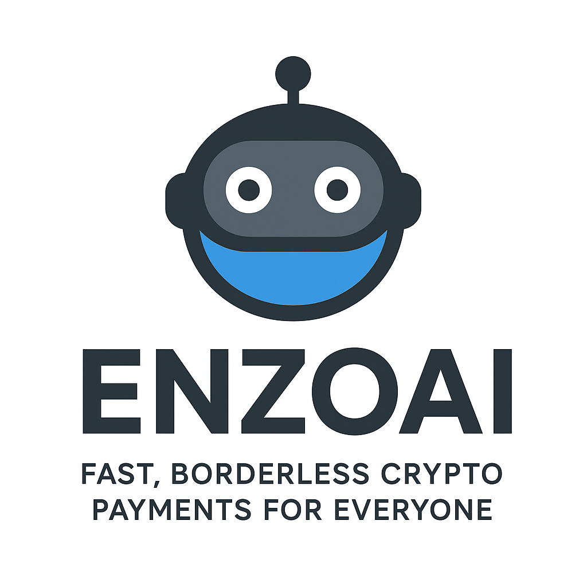

<div align="center">





### Fast, Borderless Crypto Payments for Everyone  

---

[](https://kirapay.io)
[](https://www.typescriptlang.org/)
[](https://docs.goat-sdk.com/)
[](LICENSE)

---

</div>

## 🌍 Overview  

**ENZOAI** is an **AI-powered crypto payment assistant integrated within LINE**, designed to make cross-border transactions effortless and accessible to everyone.  
By combining **conversational AI** with **blockchain technology**, users can send, receive, and trade cryptocurrency directly through chat — no complex wallets or technical barriers.  

This innovation bridges the gap between **traditional remittance** and **decentralized finance (DeFi)**, unlocking instant, low-fee, and global payments for all.  

> 💡 **Why it matters:**  
> The $860B+ remittance market is ripe for disruption — and ENZOAI enters early with an AI-driven, chat-native crypto experience that puts speed, simplicity, and control in the user’s hands.

---

## 🧩 What It Does

- 🏦 **Wallet Management** – Create, manage, and monitor wallets directly in LINE chat.  
- 💱 **Crypto Operations** – Perform swaps, trades, and payments using natural language.  
- 🔗 **KiraPay Integration** – Generate payment links, accept multi-chain payments, and track every transaction with ease.  
- 🤖 **AI Assistance** – The bot guides users step-by-step, simplifying blockchain operations for everyone.  

---

## 💳 Powered by KiraPay

**KiraPay** is a **multi-chain payment layer** for Web3 projects, platforms, and communities.  
With KiraPay, users can **pay from any blockchain**, while merchants receive funds **settled in their preferred chain** — simple, transparent, and seamless.  

### 🚀 Why KiraPay?

- 🔗 **Payment Links & APIs** – Share a link or integrate directly to start collecting crypto payments.  
- ⚡ **Multi-Chain In, One-Chain Out** – Accept from anywhere, receive where you want.  
- 📊 **Transparent & On-Chain** – Every transaction is verifiable, traceable, and data-rich.  
- 🛠 **Developer-Friendly** – REST APIs ready today; SDKs (Node.js, TypeScript, frontend) coming soon.  

> 💬 “With KiraPay, payments are no longer a headache — they’re seamless, chain-agnostic, and settlement-optimized.”

---

## ⚡ Quick Start  

### 1. Clone the Repository  
```bash
git clone https://github.com/ENZOMOTIVE/line_crypto_ai
```


2. Run the following commands from the `typescript` directory:
```bash
cd line-bot
npm install
npm build
```


3. Copy the `.env.template` and populate with your values:
```bash
cp .env.template .env
```
- `OPENAI_API_KEY`
- `WALLET_PRIVATE_KEY`
- `RPC_PROVIDER_URL`
- `Line_Bot_Channel_Access`
- `Line_Secret_key`

5. Add some test funds to your wallet by going to any [Base Sepolia Faucet](https://www.alchemy.com/faucets/base-sepolia)

## Usage
1. Run the interactive CLI:
```bash
npm ts-node index.ts
```

2. Chat with the agent:
- Autonomous Wallet Creation
- Handle Multiple Wallet
- Receive Crypto currencies
- Create Autonomoius Payment Gateways Payment with KIRAPAY


## Tech Stack
| Layer            | Technology                |
| :--------------- | :------------------------ |
| 🤖 AI Processing | OpenAI GPT API            |
| 💰 Payments      | KiraPay API               |
| 💬 Messaging     | LINE Messaging API        |
| 💻 Backend       | TypeScript + Node.js      |
| 🔗 Blockchain    | Base / Ethereum (Sepolia) |
| 🧠 Framework     | GOAT SDK                  |


