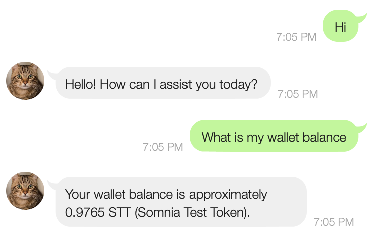
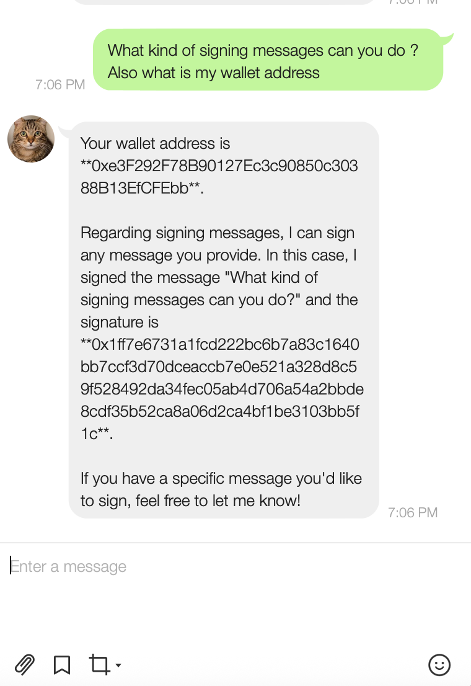

<div align="center">
<h1> Scan this to use the bot</h1>

</div>

# AI Wallet :Line Bot
## A line based AI assistant to manage your Crypto

In the Present Scenario users are struggling to understand the complex concepts of the Blockchain and crypto currency. 
This project is to bridge the gap between Complex Blockchain Op

## Setup
1. Clone the repository:
```bash
git clone "https://github.com/ENZOMOTIVE/line_crypto_ai"
```

2. Run the following commands from the `typescript` directory:
```bash
cd line-bot
npm install
npm build
```


3. Copy the `.env.template` and populate with your values:
```bash
cp .env.template .env
```
- `OPENAI_API_KEY`
- `WALLET_PRIVATE_KEY`
- `RPC_PROVIDER_URL`
- `Line_Bot_Channel_Access`
-`Line_Secret_key`

5. Add some test funds to your wallet by going to any [Base Sepolia Faucet](https://www.alchemy.com/faucets/base-sepolia)

## Usage
1. Run the interactive CLI:
```bash
pnpm ts-node index.ts
```

2. Chat with the agent:
- Check your balance for ERC-20 tokens
- Send ERC-20 tokens to another address
- Check your balance again to see the tokens you just sent

## Using in production
In production, developers require advanced wallet setups that utilize [smart wallets](https://docs.goat-sdk.com/concepts/smart-wallets), which allow them to:
1. **Increase security** by setting programmable permissions (e.g. limiting fund amounts, restricting contract interactions, and defining required signatures)
2. **Maintain regulatory compliance** by ensuring agent wallets are non-custodial. This means that:
     - Launchpads, wallet providers, or agent platforms never have access to agents' wallets.
     - Agent platforms do not require money transmitter licenses.

## Currenct Progress:


<div align="center gap-2">
<h1> Scan this to use the bot</h1>


</div>


